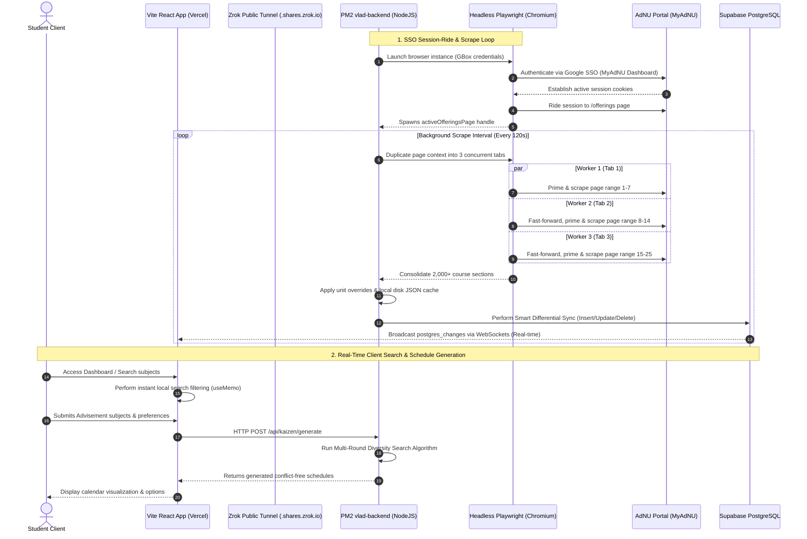

# 🌌 Vlad Trends — System Architecture & Data Flow

Vlad Trends is a highly resilient, real-time academic course schedule planning and recommendation engine. The system is designed to persistently run 24/7 on a headless background server, leveraging automated browser session-riding, concurrent scraping, smart database synchronization, and real-time frontend updates.

---

## 🗺️ Complete End-to-End System Flow



---

## 🔑 1. Authentication & SSO "Session-Ride" Strategy

Spawning persistent headless browser sessions requires bypassing Google Identity Services (GSI) and multi-factor/SSO redirects. 

* **The Google SSO Handshake**: The backend launches a Playwright Chromium instance. It first visits the MyAdNU login portal, populating GBox email and password credentials.
* **Session Capturing**: Once successfully logged in, the browser establishes global SSO session cookies on `services.adnu.edu.ph`.
* **Session Ride**: Instead of re-authenticating, Playwright opens a separate tab and navigates directly to the secure offerings endpoint `/myadnu/index.php/offerings`.
* **Handle Capture**: The node server saves the page context as `activeOfferingsPage`. This persistent tab handle is preserved in memory, allowing subsequent background operations to bypass authentication completely.

---

## ⚡ 2. High-Performance Concurrent Scraper

To avoid timeouts and scrape all 2,000+ courses in less than 20 seconds, the engine deploys a parallel worker model:

1. **View Optimization**: It automatically selects **"All Subjects"** and changes pagination settings to show **100 records per page**, reducing the total page count from 200+ to under 21.
2. **Concurrent Workers**: The scraper duplicates the active page context into **three parallel tabs** (Workers) to divide the scraping workload:
   * **Worker 1**: Scrapes pages 1 to 7.
   * **Worker 2**: Fast-forwards, primes page state, and scrapes pages 8 to 14.
   * **Worker 3**: Fast-forwards, primes page state, and scrapes pages 15 to 25.
3. **State Priming**: Because schedules sometimes split across pages (e.g., lecture and lab on adjacent pages), each worker "primes" its schedule continuity state by analyzing the page immediately preceding its start range before extracting data.

---

## 🔄 3. Smart Differential Sync & Storage

To guarantee zero downtime and minimize write load on our database tier, the system implements a strict differential storage pipeline:

* **Smart Differential Sync**: Instead of purging the database table on every scrape (which causes blank screens for active users), the backend queries all existing database course records, generates a unique composite key for each section, and performs an in-memory diff:
  * **Inserts**: New course sections are batch-inserted in sizes of 100.
  * **Updates**: Sections with changes in room, instructor, or open slots are updated in parallel chunks of 10.
  * **Deletes**: Sections no longer reported by the university portal are batch-deleted.
* **Disk Caching Fallback**: Concurrently, the completed scrape payload is saved on the server's local disk as `./data/offerings.json`.
* **Graceful Degradation**: When a client requests course data via `/api/scrape/data`, the server **primarily queries the Supabase database** (guaranteeing fresh records). If Supabase is down or rate-limited, it gracefully degrades and serves the local disk JSON cache.

---

## 📡 4. Real-Time Communication & Search Engine

Vlad Trends delivers a lag-free UI experience by combining local caching with server-sent PostgreSQL replication:

* **Instant Search Filtering**: The React dashboard loads the active offerings array once on startup. The search bar does **not** make network requests to the database on keystroke. Instead, it utilizes client-side React `useMemo` hooks to filter courses in real-time across subject codes and titles:
  ```javascript
  const filteredGroupedSubjects = useMemo(() => {
    if (!searchTerm) return groupedSubjects;
    const lowerSearch = searchTerm.toLowerCase();
    return groupedSubjects.filter(sub => 
      sub.course_code?.toLowerCase().includes(lowerSearch) || 
      sub.title?.toLowerCase().includes(lowerSearch)
    );
  }, [groupedSubjects, searchTerm]);
  ```
* **Zero-Refresh Synchronization**: To keep the local browser search cache fresh, the client initiates a **real-time WebSocket subscription** (`postgres_changes`) to Supabase. When the background scraper updates a course section's open slots or schedule in the database, the update is pushed instantly to the client's search bar, bypassing standard REST polling entirely.

---

## 🛠️ 5. Self-Healing Persistent Infrastructure

The server is configured as a "set-and-forget" Windows environment using two primary services:

* **PM2 Process Manager**: The backend application is managed by PM2 as `vlad-backend` with exponential backoff crash recovery, logging aggregation, and automatic memory limits (restarting if the browser leaking-context exceeds 500MB).
* **Headless Zrok Tunnel**: A hidden VBScript (`vlad_zrok.vbs`) is placed in the Windows Startup folder. Upon boot, it executes a headless Zrok public tunnel, exposing local port `3000` securely to `https://vlad-trends-backend.shares.zrok.io`, allowing the remote Vercel frontend client to securely communicate with the local scraping node.
